# 🛡️ VulnScan — Web Vulnerability Scanner

A professional security operations dashboard with 40+ checks, multi-API threat intelligence, and real-time scanning

---

## 📁 Project Structure

```
vulnscan/
├── index.html           # Full security dashboard UI
├── style.css            # Dark SOC theme based
├── app.js               # Dashboard JS (charts, scans, reports)
├── app.py               # Flask REST API
├── scanner.py           # 40+ vulnerability checks engine
├── api_integrations.py  # VirusTotal · Shodan · URLScan · GSB · HIBP · NVD
├── database.py          # MySQL persistence layer
├── config.py            # API keys + DB credentials
└── requirements.txt
```

---

## ✨ Features

### OWASP 2025 Top 10 (All 10)
- A01 — Broken Access Control + IDOR detection
- A02 — Cryptographic failures + HSTS + SSL cert analysis
- A03 — Injection (via dedicated injection suite)
- A04 — Insecure Design (rate limit testing)
- A05 — Security Misconfiguration (7 header checks, server disclosure, HTTP methods)
- A06 — Vulnerable Components (jQuery, Bootstrap, React, Vue, Angular)
- A07 — Auth Failures (cookie flags, autocomplete)
- A08 — Software Integrity (SRI checks)
- A09 — Logging Failures
- A10 — SSRF parameter detection

### Injection Suite (8 Vectors)
- SQL Injection (error-based + time-based blind)
- Reflected XSS + Stored XSS detection
- CSRF token missing
- Server-Side Template Injection (SSTI)
- Local File Inclusion (LFI)
- XXE detection
- Open Redirect
- CORS misconfiguration (wildcard + arbitrary reflection)

### Deep Scan
- 20 sensitive file paths (.env, .git, wp-config, phpinfo, backup.sql...)
- 6 HTTP methods enumeration (TRACE, DELETE, PUT...)
- Cookie security flags (HttpOnly, Secure, SameSite)

### DNS Security
- SPF record check
- DMARC policy check
- DNSSEC validation
- CAA record check

### SSL/TLS Analysis
- Certificate validity & expiry
- Days remaining warning
- Cipher suite strength
- Protocol version detection

### Port Scanning
- 29 ports with concurrent probing
- Service identification
- Risk-level tagging
- Critical port alerts (MySQL, Redis, MongoDB, RDP...)

### Technology Fingerprinting + CVE Lookup
- 23 tech patterns (WordPress, React, Angular, Drupal, Shopify...)
- Automatic CVE severity mapping

### External Threat Intelligence APIs
| API | Purpose | Free Tier |
|-----|---------|-----------|
| VirusTotal | URL reputation, malware engines | 4 req/min |
| Shodan | Host intel, open ports, CVEs | 1 req/sec |
| URLScan.io | Full page scan + screenshot | 60 req/min |
| Google Safe Browsing | Phishing/malware detection | Free w/ GCP |
| HaveIBeenPwned | Domain breach detection | $3.50/month |

### WAF Detection
Detects: Cloudflare, AWS WAF, Akamai, Sucuri, ModSecurity, Imperva, Barracuda, F5

---

## 🛠️ Technology Stack

**Frontend:**
- HTML5
- CSS3
- JavaScript (ES6+)
- Chart.js 4.4

**Backend:**
- Python 3.14.3
- Flask 3.0 (REST API & Backend Server)
- Requests 2.31 (HTTP Client & Web Requests)
- BeautifulSoup4 4.12 (HTML Parsing & Scraping)

**Database**
- MySQL

---

## Setup

### 1. MySQL

```sql
CREATE DATABASE vulnscan;
CREATE USER 'vulnscan_user'@'localhost' IDENTIFIED BY 'vulnscan_pass';
GRANT ALL PRIVILEGES ON vulnscan.* TO 'vulnscan_user'@'localhost';
FLUSH PRIVILEGES;
```

Update `config.py`:
```python
DB_CONFIG = {
    'host': 'localhost',
    'user': 'vulnscan_user',
    'password': 'vulnscan_pass',
    'database': 'vulnscan',
}
```

### 2. API Keys

Edit `config.py` and add your keys:
```python
API_KEYS = {
    'VIRUSTOTAL': 'your_key_here',
    'SHODAN': 'your_key_here',
    'URLSCAN': 'your_key_here',
    'GOOGLE_SAFE_BROWSING': 'your_key_here',
}
```

Don't configure them from the Settings page as for security reasons such as exposing your API key.

### 3. Python Backend

```bash
# Create virtual environment
python -m venv venv

# Activate venv
.\venv\Scripts\Activate.ps1

# Install dependencies
pip install -r requirements.txt

# Start server
python app.py
# → Running on http://127.0.0.1:5500/

```

### 4. Frontend

```bash
# Option A — Python server (recommended, avoids CORS)
python -m http.server 3000
# Open: http://localhost:3000

# Option B — VS code live server (Extension)
```

> **Demo Mode**: If the backend is offline, VulnScan shows realistic demo data so you can preview all features without setup.

---

## Troubleshoot (Backend)

Unable to install or process dependencies inside venv
```bash

# Check if python installation
python --version
# If Python is not found, install or reinstall Python first.

# Look for 
C:\vulnscan\venv\Scripts\python.exe
# If it doesn't exist, then the virtual environment is broken.

#If the folder is in use, first deactivate the virtual environment:
deactivate

# Remove the existing venv folder 
Remove-Item -Recurse -Force venv

# Recreate the virtual environment
python -m venv venv

# Activate venv
.\venv\Scripts\Activate.ps1

# Then install dependencies
python -m pip install --upgrade pip
python -m pip install -r requirements.txt
```

---

## REST API

| Method | Endpoint | Description |
|--------|----------|-------------|
| POST | `/scan` | Start new scan |
| GET | `/scan/<id>` | Get scan results |
| GET | `/scans` | List all scans |
| GET | `/stats` | Dashboard statistics |
| GET | `/health` | Server health check |

```json
POST /scan
{
  "url": "https://example.com",
  "options": {
    "scan_owasp": true,
    "scan_injection": true,
    "scan_ports": true,
    "scan_tech": true,
    "scan_ssl": true,
    "scan_dns": true,
    "scan_threat_intel": true
  }
}
```

---

## Images

### Dashboard
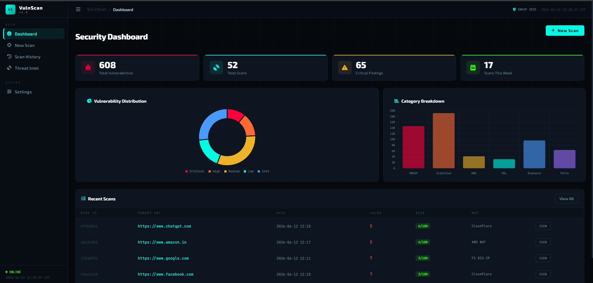

### Scan Page
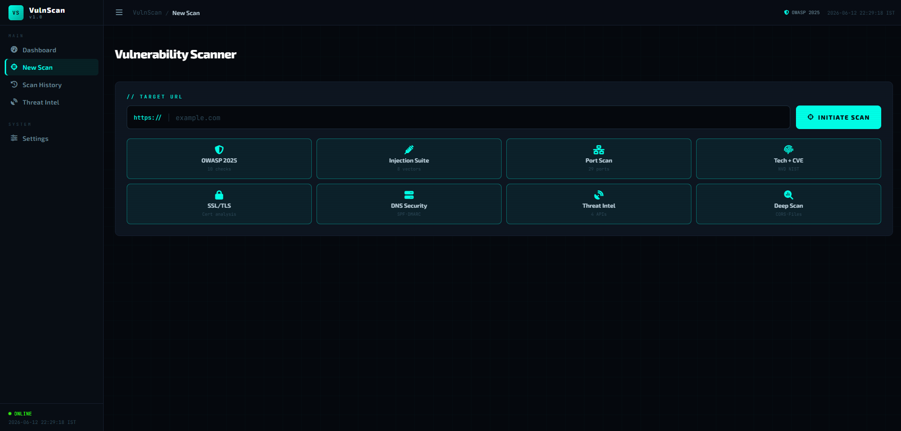

### Terminal - Scan in progress
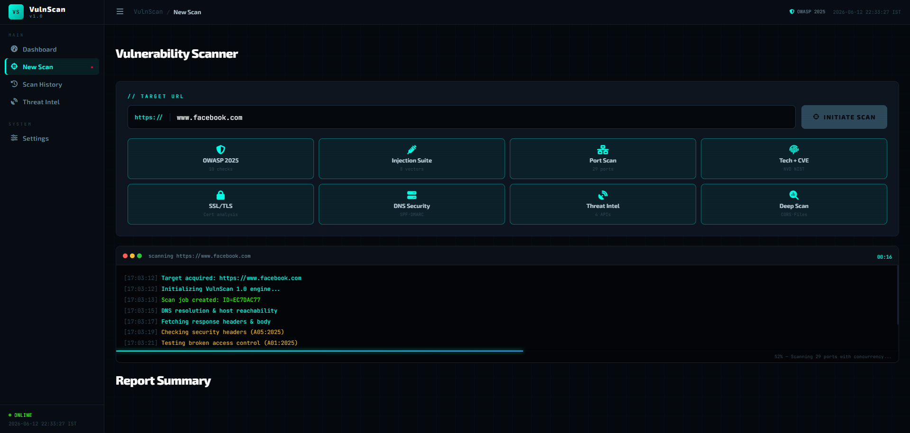

### Terminal - Scan completed
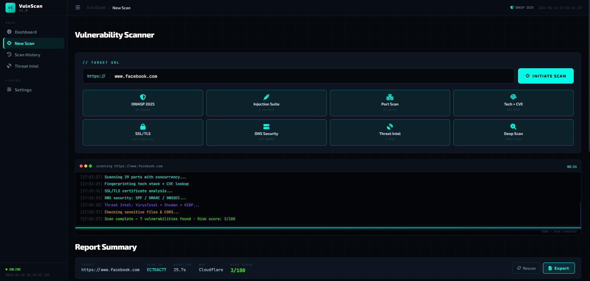

### Report Summary
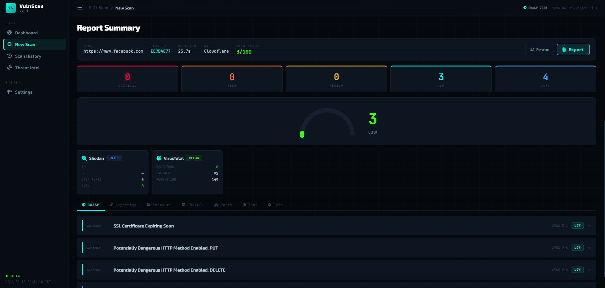

### Injection Suite (SQLi, XSS, CSRF, SSRF)
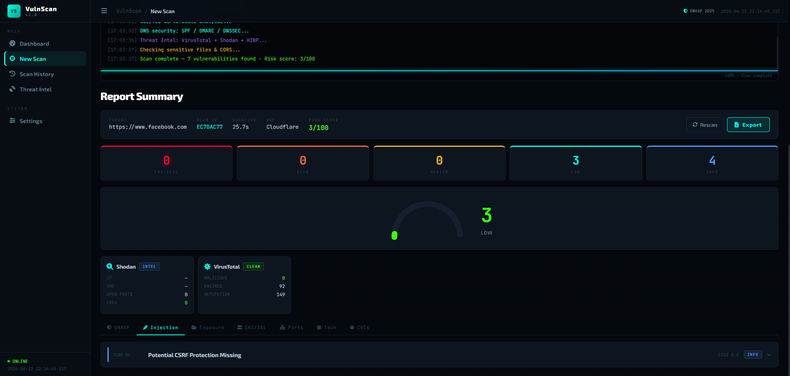

### File Exposure
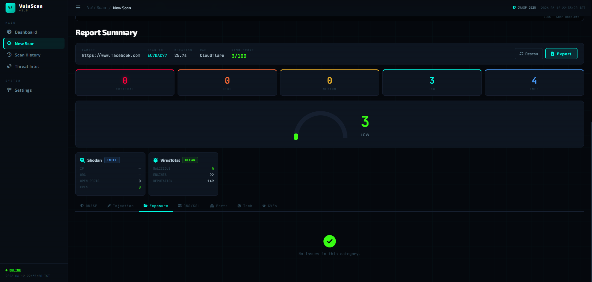

### DNS and SSL/TLS summary
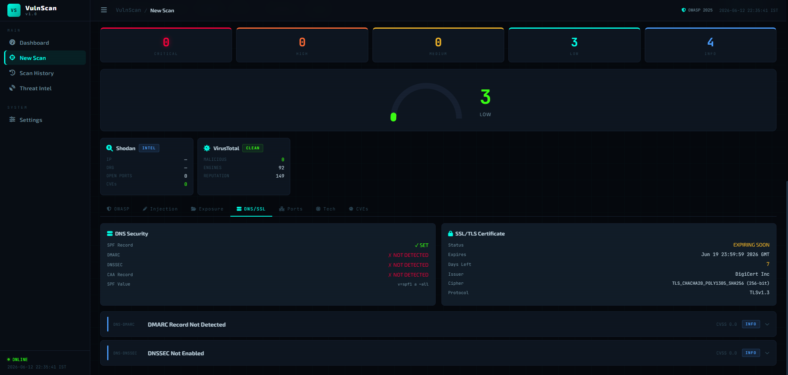

### Technology Used
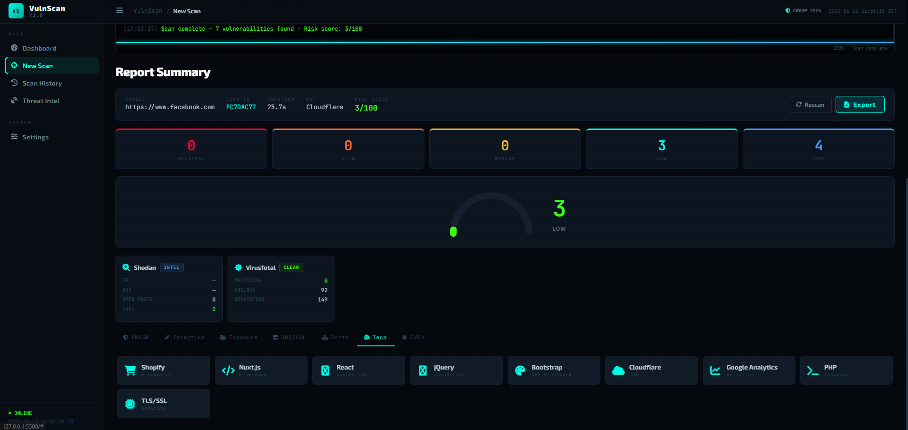

### CVE Page (If any)
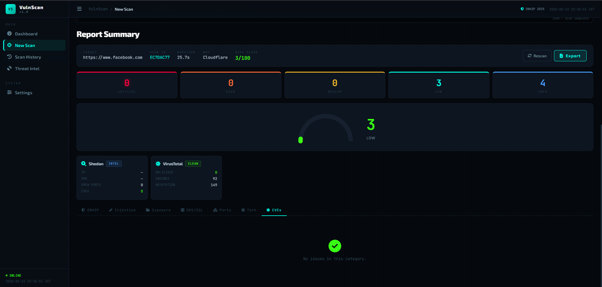

### Scan History
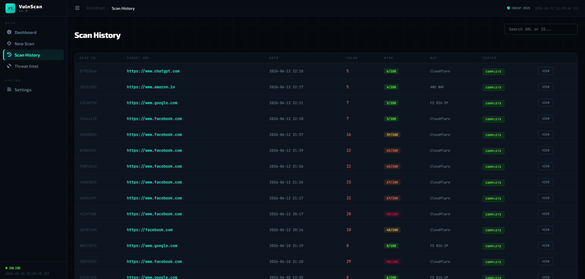

### Settings Page
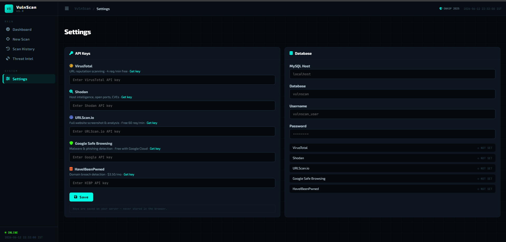

---

## Legal Disclaimer

VulnScan is for **authorized security testing only**.  
Only scan systems you own or have **written permission** to test.  
Unauthorized use may violate the India IT Act and other laws.
Developed and Tested by Avideepth Behera (Me) & Rhitik Patil (Partner in crime)
